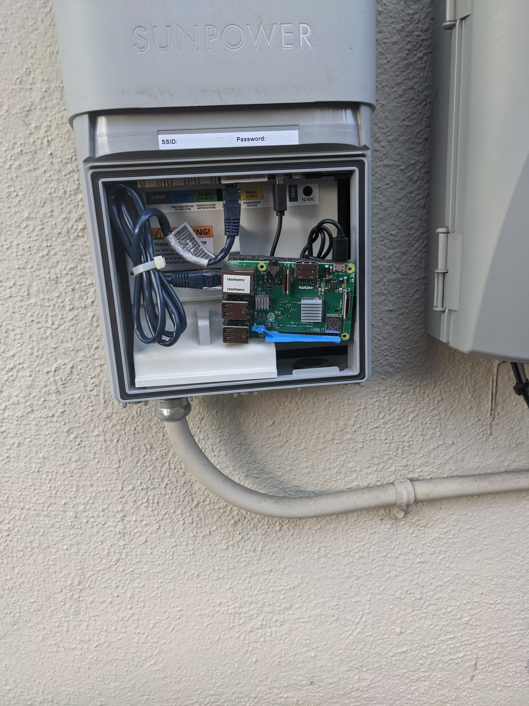

# Reading Sunpower data directly

Sunpower's [web "API"](https://monitor.us.sunpower.com/#!/dashboard) has a few problems:
* It's undocumented
* It's unsupported
* It's laggy (by about an hour)
* It's inaccurate
* It's too simplistic
* Basically, it sucks.

I spent some time cracking the API in several varieties before some kind hearted soul pointed out [an article](https://blog.gruby.com/2020/04/28/monitoring-a-sunpower-solar-system/) that noted there's an installer port availble inside of the control box. Said installer port delivers
HIGHLY detailed information, if you ask it to.

At this point, I was kind of wondering why the hell I was bothering with a crap web API?

Turns out, you can fit (just barely, but it works) a Raspberry Pi 3, a short network patch cable, and a USB power plug into the Sunpower controller box fairly nicely. Depending how you've got your home
wifi rigged, you can probably get signal to it fairly easily and it will happily respond to polling.

This is the product of my happy experiment. I encourage you to do the same.

Whether or not you decide you no longer need to keep the sunpower control box on your wifi after you do that is completely up to you, but note that there's a cellular unit in there.

## Hardware



For this I used an old [Raspberry Pi 3B+](https://www.newegg.com/p/N82E16813142011),
a [patch cable](https://www.newegg.com/p/0AS-000P-000G4) from an old router,
an old USB A to Micro B cable,
and a 32GB flash card with [Raspbian/PiOS](https://www.raspberrypi.org/software/operating-systems/#raspberry-pi-os-32-bit) installed.

There's not a ton of room in there, so the shorter you can get the cables, the better.

FWIW, I added a bit of foam to the back of the Pi to prevent accidental shorts and taped up the GPIO and secondary power block pins purely because I'm paranoid but you don't have to do that, there's very little
for them to short on. I also added a pair of [heat sinks](https://www.newegg.com/p/2S7-01JK-0JNH2) to the Pi, because the box occasionally gets full sun and things can get a bit warm in there. Pi's max out at 75&deg;C,
and I've not come close to that, but, again, I'm fairly paranoid.

## Installation

First off, install and configure your Pi. This will be much easier while it's sitting on your desktop than when it's in the enclosure. You just need to configure it enough to be able to SSH onto it, so you probably want to give the WIFI a static IP address on you network. You can either
do this on the Pi, but I've found it can be easier to use the DHCP reservation feature on your router, in case that the router loses it's mind or dies and suddenly your internal LAN config changes, or God Forbid Raspbian ever adopts systemd-resolved and starts doing screwy things with the local IP, or what-have-you.

Once you have things up and running reasonably well, and you can remote into the Pi, you can actually try installing it. Plug the network patch cable into the *Black* `Installer Computer` port, and then leech power from one of the two `USB` ports. (Remember, Pi's only use USB B for
power. Your board will probably complain about low voltage, but it's more than enough to run.)

## Network Configuration

Fortunately, things are fairly straight forward here, unless you're a significant edge case.

Chances are your home LAN is going to be on either `192.168.*.*` or `10.*.*.*`. Mine is on the latter because I like the elbow room.

If you poll your network config from your Pi, you shoud see something like:

```bash
$ ip address
1: lo: <LOOPBACK,UP,LOWER_UP> mtu 65536 qdisc noqueue state UNKNOWN group default qlen 1000
    link/loopback 00:00:00:00:00:00 brd 00:00:00:00:00:00
    inet 127.0.0.1/8 scope host lo
       valid_lft forever preferred_lft forever
    inet6 ::1/128 scope host
       valid_lft forever preferred_lft forever
2: enxb827ebebbfa3: <BROADCAST,MULTICAST,UP,LOWER_UP> mtu 1500 qdisc pfifo_fast state UP group default qlen 1000
    link/ether b8:27:eb:eb:bf:a3 brd ff:ff:ff:ff:ff:ff
    inet 172.27.153.123/24 brd 172.27.153.255 scope global dynamic noprefixroute enxb827ebebbfa3
       valid_lft 525sec preferred_lft 384sec
    inet6 fe80::56e3:9ac2:d44d:d1d8/64 scope link
       valid_lft forever preferred_lft forever
3: wlan0: <BROADCAST,MULTICAST,UP,LOWER_UP> mtu 1500 qdisc pfifo_fast state UP group default qlen 1000
    link/ether b8:27:eb:be:ea:f6 brd ff:ff:ff:ff:ff:ff
    inet 10.10.1.127/24 brd 10.10.1.255 scope global dynamic noprefixroute wlan0
       valid_lft 60617sec preferred_lft 45521sec
    inet6 2600:1700:1150:8a6f:a50d:fa28:68b:505b/64 scope global dynamic mngtmpaddr noprefixroute
       valid_lft 2998sec preferred_lft 2998sec
    inet6 fe80::f3b5:4fdd:132:da71/64 scope link
       valid_lft forever preferred_lft forever
```
Note that here, network #2 has an `inet` set to `172.27.153.123`. That's because the controller is using it's own DHCP to set an address in the third private block `172.27.0.0/16`. Fortunately, thanks to modern routing software, unless you're using that block for your home network, the Pi should route requests happily, and send all normal traffic out the `wlan0`, and keep just the controller traffic on your wired connection.

If not, well, fun personal education lies ahead as you either switch your home LAN to a different subnet or work out how to limit connector traffic to just the connector block.

You'll know things are working if you do a `ping 172.27.153.1` and get a quick response. Note, that the panel "server" is located at the `172.27.*.1` address for your block. If your DHCP address is different than mine, you may need to adjust accordingly.

Once you have your appropriate address, edit your `/etc/hosts` file and append it as:

```
172.27.153.1    sunpowerconsole.com
```
(Again, adjusting the address as neccessary)

You should then be able to run a command like

```html
$ curl -v http://sunpowerconsole.com/
*   Trying 172.27.153.1:80...
* Connected to sunpowerconsole.com (172.27.153.1) port 80 (#0)
> GET / HTTP/1.1
> Host: sunpowerconsole.com
> User-Agent: curl/7.72.0
> Accept: */*
>
* Mark bundle as not supporting multiuse
< HTTP/1.1 200 OK
< Cache-Control: no-store, no-cache, must-revalidate, post-check=0, pre-check=0
< Content-Type: text/html
< Accept-Ranges: bytes
< ETag: "3805951611"
< Last-Modified: Fri, 24 Jan 2020 11:23:23 GMT
< Content-Length: 2286
< Date: Wed, 30 Dec 2020 17:44:27 GMT
< Server: lighttpd/1.4.35
<
<!DOCTYPE html>
<html ng-app="app" ng-strict-di>
<head lang="en">
    <meta charset="UTF-8">
    <meta http-equiv="cache-control" content="max-age=0" />
    <meta http-equiv="cache-control" content="no-cache" />
    <meta http-equiv="expires" content="0" />
    <meta http-equiv="expires" content="Tue, 01 Jan 1980 1:00:00 GMT" />
    <meta http-equiv="pragma" content="no-cache" />
    <script>
        document.write('<base href="' + document.location.pathname.replace("index.html", "") + '" />');
    </script>
    <title>SunPower</title>
    <meta name="BuildNumber" content="2018.07.33 (jenkins-pvsmgmt-console-staging-prod-fx9-build-33)">
    <link rel="shortcut icon" href="images/favicon.ico?bust=v07302018092854" type="image/icon"/><link rel="icon" href="images/favicon.ico?bust=v07302018092854" type="image/icon"/>
    <link href="css/app.css?bust=v07302018092854 " rel="stylesheet" type="text/css"/>
    <!-- scriptinject begin -->
    <script src="app.js?bust=v07302018092854"></script>
    <!-- scriptinject end -->

    <script>
        (function (i, s, o, g, r, a, m) {
            i['GoogleAnalyticsObject'] = r; i[r] = i[r] || function () {
                (i[r].q = i[r].q || []).push(arguments)
            }, i[r].l = 1 * new Date(); a = s.createElement(o),
            m = s.getElementsByTagName(o)[0]; a.async = 1; a.src = g; m.parentNode.insertBefore(a, m)
        })(window, document, 'script', '//www.google-analytics.com/analytics.js', 'ga');
    </script>

</head>
<body>
    <sp-help-button></sp-help-button>
    <overlay></overlay>
    <div id="container" class="sp-shadow sp-shadow-off">

        <div sp-header class="sp-header sp-header-on"></div>

        <div class="sp-main">
            <div class="sp-menu sp-menu-on">
                <div></div>
            </div>

            <div class="sp-view sp-view-on">
                <!-- Main content area -->
                <div class="loader-wrapper" ng-show="show_loader">
                    <div class="global-loader"></div>
                </div>
                <div ui-view class="sp-animate"></div>
            </div>
        </div>

        <div sp-footer class="sp-footer"></div>
    </div>
    <script>
        $(document).foundation();
    </script>
</body>
</html>
* Connection #0 to host sunpowerconsole.com left intact
```

A few things to note in that.
1) Yes, they're running google analytics on the installer setup page.
2) Yes, the bulk of the page is delivered via javascript, so dillo isn't going the help a lot there. If you want to play, you're going to have to run Firefox or Chromium.
3) Yes, there's a cellular backup chip in there, so dropping the box from your LAN won't completely disconnect it, until it ages out, I suppose. Still, probably a good idea.

Honestly, there's not a lot to really monkey with using that setup. What you really want is the tasty, tasty data that's driving a lot of that.

Fortunately, that's really easy to get.

## Installing the CGI

You don't need a super powerful HTTP server. In fact, I run lighttpd on mine because really, all I need to do is have a way to call a python CGI script. I probably could just run a multi-threaded python gunicorn script that listens on a given port and responds with the JSON, but I do that kind of crap at work and sometimes, life is just too short to deal with that kinda crap.

To get things working:
```bash
$ sudo apt install lighttpd && \
  pip3 install RPi.GPIO requests && \
  mkdir -p /var/www/cgi && \
  cp lighttpd/conf-enabled/10-cgi.conf /etc/lighttpd/conf-enabled/ && \
  cp cgi/fetch.py /var/www/cgi/fetch.py
```

You can then start lighttp
```bash
$ sudo service lighttpd start
```

and try querying it to see if things are working

<a name="fetch_example"></a>
```json
$ curl http://localhost/cgi/fetch.py
{
 "pi": 47.77,
 "generated": 1.63,
 "panel_temp_avg": 21.73,
 "panel_temp_low": 17.0,
 "panel_temp_hi": 25.75,
 "panel_22_kw": 0.16,
 "panel_22_temp": 20.75,
 "panel_29_kw": 0.1233,
 "panel_29_temp": 17.25,
 ...
 "panel_42_kw": 0.1628,
 "panel_42_temp": 25.75
}
```

Feel free to dig into the `fetch.py` script and customize it how you see fit. FWIW, I had... issues... when I tried to bring a list of dicts into home_assistant, thus why I broke things out. Cleverer souls may know more optimal ways to resolve that. My PRs are open.

In case you're curious, here's what the `DeviceList` command dumps out:

```json
{
 "devices": [
  {
   "DETAIL": "detail",
   "STATE": "working",
   "STATEDESCR": "Working",
   "SERIAL": "ZT163385000441C0578",
   "MODEL": "PV Supervisor PVS5",
   "HWVER": "3.3",
   "SWVER": "2020.1, Build 3008",
   "DEVICE_TYPE": "PVS",
   "DATATIME": "2020,12,30,18,35,00",
   "dl_err_count": "0",
   "dl_comm_err": "216",
   "dl_skipped_scans": "0",
   "dl_scan_time": "0",
   "dl_untransmitted": "816099",
   "dl_uptime": "9797444",
   "dl_cpu_load": "0.32",
   "dl_mem_used": "59952",
   "dl_flash_avail": "12436",
   "panid": 1446673867,
   "CURTIME": "2020,12,30,18,38,36"
  },
  {
   "ISDETAIL": true,
   "SERIAL": "PVS5M527635p",
   "TYPE": "PVS5-METER-P",
   "STATE": "working",
   "STATEDESCR": "Working",
   "MODEL": "PVS5M0400p",
   "DESCR": "Power Meter PVS5M527635p",
   "DEVICE_TYPE": "Power Meter",
   "SWVER": "4",
   "PORT": "",
   "DATATIME": "2020,12,30,18,38,28",
   "ct_scl_fctr": "50",
   "net_ltea_3phsum_kwh": "0",
   "p_3phsum_kw": "0",
   "q_3phsum_kvar": "0",
   "s_3phsum_kva": "0",
   "tot_pf_rto": "1",
   "freq_hz": "60.02",
   "CAL0": "50",
   "origin": "data_logger",
   "OPERATION": "noop",
   "CURTIME": "2020,12,30,18,38,36"
  },
  {
   "ISDETAIL": true,
   "SERIAL": "414051709015422",
   "TYPE": "SOLARBRIDGE",
   "STATE": "working",
   "STATEDESCR": "Working",
   "MODEL": "AC_Module_Type_C",
   "DESCR": "Inverter 414051709015422",
   "DEVICE_TYPE": "Inverter",
   "SWVER": "951007408",
   "PORT": "",
   "MOD_SN": "N19M20671130",
   "NMPLT_SKU": "513820",
   "DATATIME": "2020,12,30,18,36,13",
   "ltea_3phsum_kwh": "1580.5081",
   "p_3phsum_kw": "0.0667",
   "vln_3phavg_v": "240.5431",
   "i_3phsum_a": "0.4",
   "p_mpptsum_kw": "0.07",
   "v_mppt1_v": "55.5044",
   "i_mppt1_a": "1.1766",
   "t_htsnk_degc": "23.75",
   "freq_hz": "60.0024",
   "stat_ind": "0",
   "origin": "data_logger",
   "OPERATION": "noop",
   "CURTIME": "2020,12,30,18,38,36"
  },

  ...
  ],
 "result": "succeed"
}
```

There are three `TYPE`s of devices that are listed, each with their own attributes. Fortunately, if you want to learn more about what the  additional commands and what the attributes mean, you can [read this page](https://github.com/ginoledesma/sunpower-pvs-exporter/blob/master/sunpower_pvs_notes.md).

I'll also note that values are updated every 5 minutes.

## Integrating with Home Assistant

Like damn near everyone, I'm not a fan of YAML. However, it's the configuration option that HomeAssistant has chosen, thus what must be used.

YAML doesn't seem to appreciate complex data structures. Sometimes it accepts a list of dictionaries, sometimes it doesn't. It feels oddly arbitrary. It does accept a flat dictionary of values, so I constructed the returned result accordingly. (See [above](#fetch_example))

In the `.homeassistant/configuration` file, I added:

```yaml
# solar:
sensor:
  - platform: command_line
    scan_interval: 300  # poll every 5 minutes
    name: Solar Production
    command: "curl http://rpi_sun/cgi/fetch.py"  # this is the URL to the raspberry pi I installed into the sunpower box. I added a `/etc/hosts` alias to the LAN IP addr.
    json_attributes:  # This matches the return of fetch.py
        - generated
        - pi
        - panel_temp_hi
        - panel_temp_low
        - panel_temp_avg
        - panel_18_kw
        # ... etc. ad nausuem
        - panel_42_kw
    value_template: '{{ value_json.generated }}'
    unit_of_measurement: "kW"

  - platform: template
    sensors:
      solar_rpi_temp:
        value_template: '{{ states.sensor.solar_production.attributes.pi }}'
        unit_of_measurement: °C
      solar_panel_temp_low:
        value_template: '{{ states.sensor.solar_production.attributes.panel_temp_low }}'
        unit_of_measurement: °C
      solar_panel_temp_hi:
        value_template: '{{ states.sensor.solar_production.attributes.panel_temp_hi }}'
        unit_of_measurement: °C
      solar_panel_temp_avg:
        value_template: '{{ states.sensor.solar_production.attributes.panel_temp_avg }}'
        unit_of_measurement: °C
      solar_panel_0_kw:
        value_template: '{{ states.sensor.solar_production.attributes.panel_18_kw }} '
        unit_of_measurement: kw
      # ... and so on ...
      solar_panel_14_kw:
        value_template: '{{ states.sensor.solar_production.attributes.panel_42_kw }} '
        unit_of_measurement: kw
```

In the `ui-lovelace.yaml` file, I added:
```yaml
    - type: vertical-stack
      cards:
        - type: horizontal-stack
            cards:
            - type: gauge
                entity: sensor.solar_production
                min: 0
                max: 3.5  # I've got a 4.2kW max array. It rarely goes past this for lots of reasons.
                name: Solar
                severity:
                    green: 1.8
                    yellow: 1.5
                    red: 0
            - type: gauge
                entity: sensor.solar_rpi_temp
                min: 90
                max: 180
                name: RPi Temp
                severity:
                    green: 150
                    yellow: 170
                    red: 180
            - type: entities
                entities: [ sun.sun ]
```
(note, the temps are autoconverted to non-celcius, sadly.)

The temperatures and panel kW are automagically added to the logging history data, but are joyously query and scriptable, so have at!
